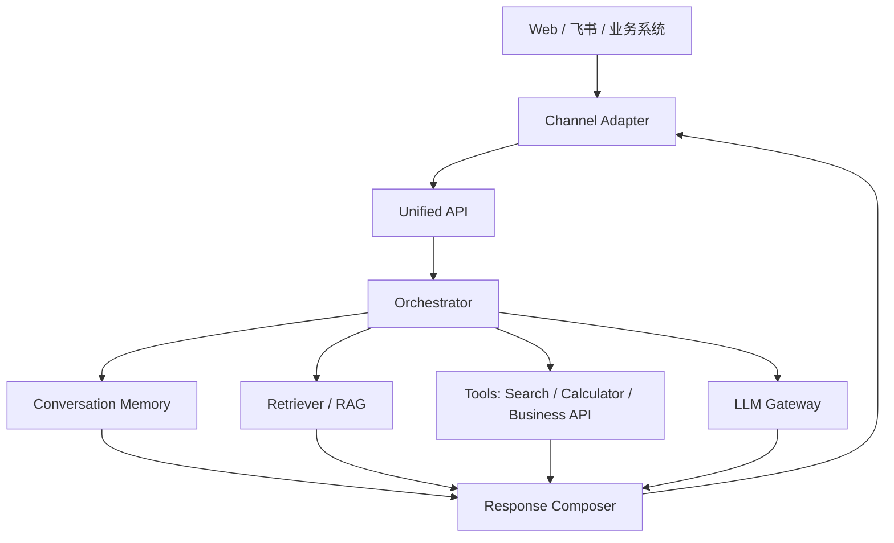

# Unified Agentic RAG 统一 API 服务：实际意义与初步架构

## 1. 项目定位

本项目不是把 `D:\LLM` 下四个基础 LLM 应用简单拼成一个“大而全 Demo”，而是将它们沉淀为一个可投入生产演进的统一 Agentic RAG 服务。

目标形态是：对外提供统一 API，内部通过编排层自主决定是否使用本地知识库检索、会话上下文改写、联网搜索、计算器或其他业务工具，最终返回可追踪来源、可观测过程、可降级的回答。

该服务可以接入：

- Web 前端
- 飞书机器人
- 企业微信或钉钉机器人
- 客服系统
- 内部业务系统
- CLI 或自动化脚本

生产视角下，真正有价值的不是“功能多”，而是形成一个稳定的智能任务处理平台：

- 能理解连续对话
- 能查企业私有知识
- 能查外部最新信息
- 能调用工具完成计算或业务动作
- 能在高并发下稳定返回
- 能提供来源、轨迹、日志和错误降级

## 2. 生产实际意义

四个基础项目组合后的核心意义，是把“单点 LLM 能力”升级为“可接入业务系统的 Agentic RAG 平台”。

典型生产问题往往不是单一检索或单一搜索能够解决的。例如：

```text
帮我根据公司知识库里的退款政策，结合官网最新公告，
判断客服应该如何回复用户，并给出引用来源。
```

单个模块的能力边界如下：

- 基础 RAG 只能查本地知识库，无法处理外部最新信息。
- 会话检索能理解追问，但仍主要围绕本地知识。
- 联网 Agent 能搜索和计算，但如果缺少知识库约束，回答容易漂移。
- 异步服务能提升吞吐量，但它本身不是完整业务能力。

组合后可以形成完整闭环：

```text
用户问题
  -> 会话理解与追问改写
  -> 判断是否需要本地知识库、联网搜索或工具调用
  -> 并行检索企业知识与外部信息
  -> 调用 LLM 汇总、比较、引用来源
  -> 返回答案、来源、工具轨迹和请求 ID
```

适合落地的生产场景包括：

- 企业内部知识问答
- 客服辅助回复
- 售前售后支持
- 技术文档助手
- 运维排障助手
- 市场信息与竞品分析助手
- 合同、制度、流程类问答

生产价值主要体现在：

- 降低员工查资料成本
- 提升客服或运营响应速度
- 统一管理企业知识入口
- 将最新外部信息纳入回答依据
- 通过来源和工具轨迹提升可信度
- 通过异步服务化支撑多人并发使用

## 3. 四个现有项目的能力映射

| 现有项目 | 生产化后承担的能力 | 说明 |
| --- | --- | --- |
| `Basic_RAG_QA_API` | Knowledge Ingestion + Retriever | 负责文档上传、切块、向量化、Chroma 检索、本地知识问答 |
| `Contextualized_conversational_retrieval` | Conversation Memory + Question Rewriter | 负责 session、历史消息、追问改写、上下文压缩 |
| `Network-connected_AI_Agent` | Tool Runtime + Agent Planner | 负责联网搜索、计算器、工具调用轨迹、ReAct 风格规划 |
| `High-performance_async_service` | Async API Service Runtime | 负责 FastAPI、异步调用、并发压测、超时、错误处理、吞吐对比 |

建议新建统一项目 `Unified_API_service`，不要在四个旧项目中原地合并。

原因：

- 旧项目带有教学阶段的重复模型、同步链路和演示逻辑。
- 生产系统需要统一配置、统一 schema、统一错误模型。
- 新项目可以复用旧项目的成熟模块思路，但避免代码结构混杂。
- 未来接入飞书、权限、日志、监控时，统一项目更容易演进。

## 4. 初步系统架构

整体采用分层架构：



### 4.1 API 层

API 层负责统一对外暴露服务能力。

建议初版提供：

- `GET /health`：健康检查
- `POST /ask`：统一问答入口
- `POST /documents/upload`：文档上传与入库
- `GET /sessions/{session_id}`：查看会话状态
- `DELETE /sessions/{session_id}`：清理会话
- `POST /channels/feishu/events`：飞书事件回调入口

API 层不直接写复杂业务逻辑，只负责：

- 请求校验
- 鉴权
- 生成 `request_id`
- 调用 Orchestrator
- 格式化 HTTP 响应

### 4.2 Channel Adapter 层

Channel Adapter 负责把不同入口转换为统一内部请求。

初版建议支持：

- `api`：普通 HTTP API 调用
- `feishu`：飞书机器人消息事件

适配器职责：

- 解析用户身份
- 解析消息内容
- 生成或映射 session_id
- 转换为统一 `AskRequest`
- 将统一响应渲染回对应渠道

这样飞书逻辑不会污染核心 Agentic RAG 编排层。

### 4.3 Orchestrator 层

Orchestrator 是统一服务的“大脑”。

职责包括：

- 判断问题是否需要 RAG
- 判断是否需要联网搜索
- 判断是否需要工具调用
- 管理多路检索和并发调用
- 处理超时、失败和降级
- 汇总检索结果、工具结果和 LLM 输出

初版可以采用规则优先、LLM 辅助的轻量路由：

| 路由类型 | 触发场景 | 动作 |
| --- | --- | --- |
| `direct` | 问候、简单常识、无需检索 | 直接调用 LLM |
| `rag` | 涉及企业文档、制度、产品资料 | 查本地知识库 |
| `web` | 涉及时效性、新闻、天气、价格 | 调用搜索工具 |
| `agentic_rag` | 同时需要内部知识和外部信息 | RAG + 搜索 + LLM 汇总 |
| `tool` | 需要计算或业务 API | 调用工具后生成答案 |

### 4.4 Retrieval 层

Retrieval 层负责知识库相关能力。

初版能力：

- 文档上传
- PDF/TXT 解析
- 文本切块
- embedding
- Chroma 持久化
- top_k 检索
- 多路 query 检索
- 去重、排序、来源格式化

后续可增强：

- BM25 + Vector 混合检索
- reranker 重排
- 多知识库隔离
- 基于用户权限过滤文档
- 文档版本管理

### 4.5 Tool 层

Tool 层负责可被 Agent 调用的外部能力。

初版工具：

- `web_search`：联网搜索，优先 Serper.dev，后续可加 Tavily
- `calculator`：安全计算器
- `knowledge_search`：本地知识库检索工具

后续工具：

- CRM 查询
- 工单查询
- 数据库只读查询
- 日程或审批系统查询
- 内部业务 API

工具必须统一返回结构化结果，方便记录 trace 和来源。

### 4.6 LLM Gateway 层

LLM Gateway 负责统一模型调用。

初版默认 DeepSeek API，使用 OpenAI-compatible 异步客户端。

职责：

- 统一模型配置
- 统一 prompt 模板
- 控制 max_tokens、temperature
- 支持超时和重试
- 支持 mock 模型用于测试
- 预留 OpenAI、本地模型或其他兼容模型切换能力

### 4.7 Response Composer 层

Response Composer 负责把多个模块的输出合并为用户可读答案。

输出内容包括：

- 最终答案
- 引用来源
- 工具调用轨迹
- 使用的路由类型
- request_id
- session_id
- 耗时统计

如果用于飞书，还需要把响应渲染成：

- 纯文本回复
- 富文本消息
- 飞书卡片

## 5. 飞书接入思路

飞书不应该直接调用 RAG、LLM 或搜索工具，而应该作为 Channel Adapter 接入统一 API。

推荐流程：

```text
飞书用户发送消息或 @ 机器人
  -> 飞书开放平台推送事件到 /channels/feishu/events
  -> 校验 challenge / token / 签名
  -> 提取 open_id、chat_id、message_id、文本内容
  -> 映射为统一 AskRequest
  -> 调用 Orchestrator
  -> 将 AgentResponse 渲染成飞书消息
  -> 调用飞书 reply/send API 返回结果
```

飞书接入初版建议只做：

- 单聊文本问答
- 群聊 @ 机器人问答
- 基于 `open_id + chat_id` 生成 session_id
- 返回答案和简化来源列表
- 失败时返回友好的降级提示

暂不建议初版做：

- 复杂飞书卡片交互
- 多步骤审批动作
- 主动群发
- 文件上传到飞书后自动入库

这些可以在统一 API 稳定后再扩展。

## 6. MVP 建设路线

### 阶段 1：统一 API 骨架

目标：

- 新建 `Unified_API_service`
- 建立 FastAPI 异步服务
- 定义统一请求和响应模型
- 接入 DeepSeek LLM Gateway
- 提供 mock Retriever 和 mock Tool

验收：

- `/health` 返回正常
- `/ask` 能返回统一结构
- 响应包含 `request_id`、`route`、`answer`、`sources`、`tool_trace`

### 阶段 2：接入本地 RAG

目标：

- 迁移基础 RAG 的上传、切块、向量化、Chroma 检索逻辑
- 实现 `knowledge_search`
- 支持文档来源返回

验收：

- 上传文档后可问答
- 答案能引用本地文档来源
- top_k 生效

### 阶段 3：接入会话上下文

目标：

- 支持 session_id
- 支持追问改写
- 支持历史消息存储
- 支持会话清理

验收：

- 用户第二轮问“它有什么优点”时，系统能理解“它”指代上一轮主题。
- 返回 `standalone_question` 或等价的追问改写结果。

### 阶段 4：接入联网 Agent 工具

目标：

- 接入 Serper.dev 搜索
- 接入 calculator
- 支持工具调用 trace
- Orchestrator 能根据问题决定是否搜索

验收：

- 问“今天北京天气适合穿羽绒服吗”时，系统能先搜索天气，再结合温度给建议。
- 返回搜索来源和工具调用轨迹。

### 阶段 5：接入飞书机器人

目标：

- 实现飞书事件回调入口
- 支持 challenge 校验
- 支持文本消息解析
- 支持调用飞书回复接口

验收：

- 飞书单聊机器人可以提问并收到回答。
- 群聊 @ 机器人可以触发回答。
- 同一用户和会话能保持上下文。

### 阶段 6：生产化增强

目标：

- 鉴权和限流
- 超时、重试、降级
- 请求日志和 trace_id
- 成本统计
- 并发压测
- Docker 部署

验收：

- 高并发下接口不阻塞。
- 外部搜索失败时仍能降级为本地 RAG 或直接说明无法获取最新信息。
- 日志中能按 request_id 追踪一次完整请求。

## 7. 初步接口草案

### 7.1 统一问答请求

```json
{
  "channel": "api",
  "user_id": "user_001",
  "session_id": "optional-session-id",
  "question": "请根据公司知识库和最新公开信息，解释我们的退款政策",
  "knowledge_scope": ["default"],
  "need_web": "auto",
  "top_k": 5,
  "return_trace": true
}
```

字段说明：

| 字段 | 类型 | 说明 |
| --- | --- | --- |
| `channel` | string | 来源渠道，如 `api`、`feishu` |
| `user_id` | string | 用户标识，用于权限、审计和会话 |
| `session_id` | string/null | 会话 ID，不传则自动创建 |
| `question` | string | 用户问题 |
| `knowledge_scope` | list[string] | 知识库范围，初版可默认 `default` |
| `need_web` | string | `auto`、`always`、`never` |
| `top_k` | int | 检索返回来源数量 |
| `return_trace` | bool | 是否返回工具调用轨迹 |

### 7.2 统一问答响应

```json
{
  "request_id": "req_abc123",
  "session_id": "sess_001",
  "route": "agentic_rag",
  "answer": "根据公司知识库和公开信息，建议客服这样回复...",
  "sources": [
    {
      "title": "退款政策说明",
      "url": "",
      "source_type": "knowledge_base",
      "snippet": "用户在付款后 7 天内...",
      "score": 0.87
    }
  ],
  "tool_trace": [
    {
      "tool_name": "web_search",
      "tool_input": {
        "query": "公司 官网 退款 公告"
      },
      "status": "success",
      "latency_ms": 820
    }
  ],
  "timing": {
    "retrieval_ms": 120,
    "tool_ms": 850,
    "llm_ms": 1600,
    "total_ms": 2600
  }
}
```

### 7.3 飞书事件入口

```text
POST /channels/feishu/events
```

职责：

- 接收飞书事件
- 校验请求
- 处理 challenge
- 提取消息内容
- 调用统一 `/ask` 的内部服务函数
- 通过飞书 API 回复消息

该接口不直接暴露完整 Agentic RAG 逻辑。

## 8. 生产化关注点

### 8.1 鉴权与权限

必须设计：

- API Key 或内部 JWT
- 飞书事件签名校验
- 用户身份映射
- 知识库访问范围控制

避免任何用户都能查询全部内部文档。

### 8.2 超时、重试与降级

外部依赖包括：

- LLM API
- 搜索 API
- 向量库
- 飞书 API

建议：

- 每个外部调用设置 timeout
- 搜索失败时降级为本地 RAG
- RAG 无结果时提示“未检索到可靠来源”
- LLM 失败时返回友好错误和 request_id
- 不向用户暴露内部异常栈或密钥路径

### 8.3 日志与可观测性

每次请求记录：

- request_id
- user_id
- channel
- route
- 使用工具
- 检索数量
- 总耗时
- 错误类型
- token 用量

后续可接入：

- OpenTelemetry
- Prometheus
- Grafana
- ELK / Loki

### 8.4 成本控制

生产系统必须控制：

- LLM token 成本
- 搜索 API 调用次数
- embedding 成本
- 并发峰值

建议：

- 对搜索结果做缓存
- 对常见问题做答案缓存
- 对长历史做摘要压缩
- 对大文档入库做异步任务
- 对用户或部门设置配额

### 8.5 安全与合规

需要注意：

- 不把 API Key 写入 `.env.example`
- 不在日志中打印用户敏感内容和密钥
- 不把内部异常直接返回客户端
- 对上传文件做类型、大小和内容安全检查
- 对工具调用做白名单限制

## 9. 初步目录建议

建议新项目目录结构：

```text
Unified_API_service/
  app/
    main.py
    config.py
    models.py
    orchestrator.py
    llm/
      gateway.py
      prompts.py
    retrieval/
      ingest.py
      retriever.py
      vector_store.py
    memory/
      store.py
      rewrite.py
    tools/
      search.py
      calculator.py
      registry.py
    channels/
      feishu.py
      api.py
    observability/
      logging.py
      tracing.py
  tests/
  bench/
  README.md
  requirements.txt
  .env.example
```

目录职责：

- `orchestrator.py`：统一调度核心。
- `llm/`：统一模型调用。
- `retrieval/`：文档入库和检索。
- `memory/`：会话和追问改写。
- `tools/`：Agent 可调用工具。
- `channels/`：飞书、Web、API 等入口适配。
- `observability/`：日志、trace、指标。

## 10. 初步结论

将四个基础 LLM 应用重构成统一 Agentic RAG 服务，在生产上是有明确意义的。

但关键不是“合并代码”，而是统一抽象：

- 统一请求响应模型
- 统一编排层
- 统一工具协议
- 统一知识检索接口
- 统一会话记忆
- 统一异步运行时
- 统一日志和错误处理

推荐路线是：

```text
新建 Unified_API_service
  -> 先完成统一 API 和 Orchestrator
  -> 再逐步迁移 RAG、会话、Agent 工具和异步压测能力
  -> 最后接入飞书与生产化治理
```

这样可以最大化复用已有项目经验，同时避免教学 Demo 代码直接进入生产架构。
